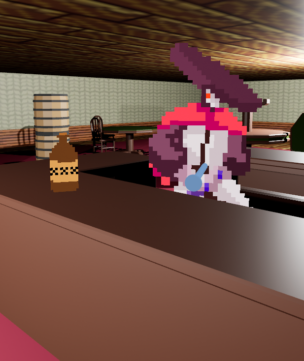
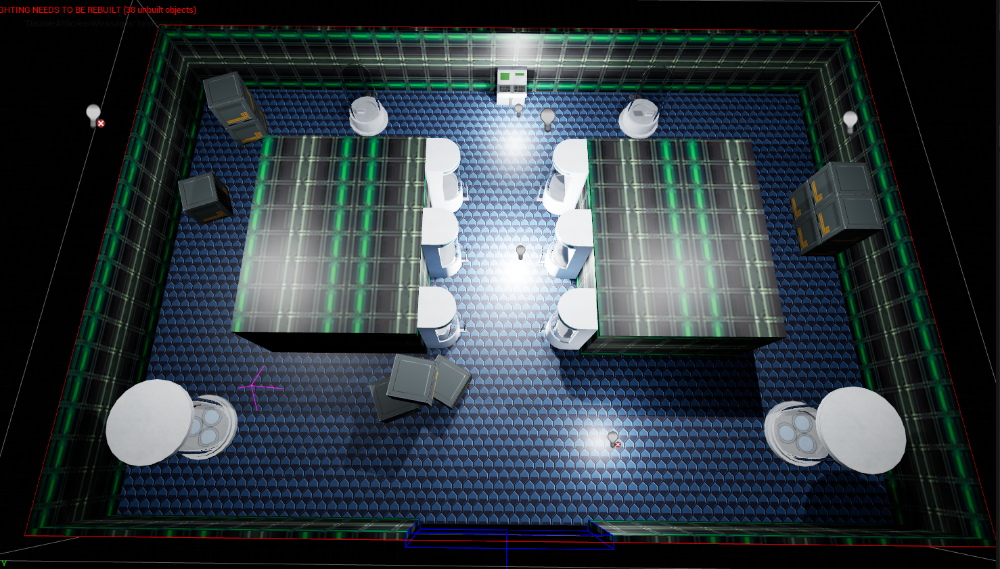
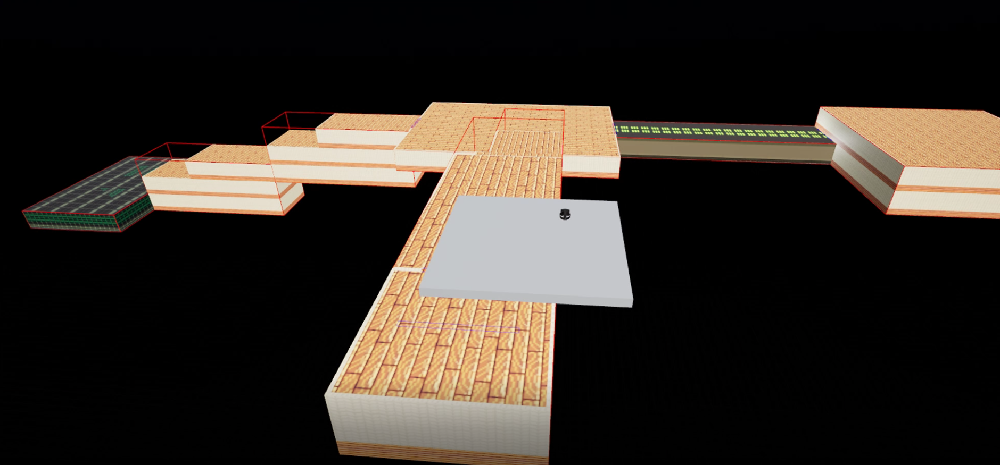

# Kronos
Kronos is a virtual reality video game with roguelike elements
in which time is falling apart at the seams. It falls on the protagonist, Kronos, to restore the timeline to its chronological order.
Along the way, the hero is met with obstacles to overcome
to achieve this goal. Kronos has pixelated 2D art sprites and
textures in a 3D world that is inspired by games like DOOM
(1993) and Paranautical Activity. The game is a first-person
shooter where you are traveling between a mismatch of time
periods in order to restore the original order of time. Kronos is
built using Unreal Engine 5 and a Procedural Dungeon Plugin
created by BenPyton. The behaviors of the enemies within the
game, the item effects, and the weapon mechanics are created
using Unreal Engine’s Blueprint system, which is a visual
scripting language. Each floor is set in a different time period
with various elements about each period feeling out of place.
This can be seen in the enemies and objects within the level.

&nbsp;

---

## Art Style

\
We decided to approach the art style of the enemies and items by making them 2D sprites. This allowed us to capture the feeling of an old school game such as Doom (1993). We decided to keep the world and environment 3D to provide less of a jarring experience for the player.

&nbsp;

---

## Procedural Generation

The dungeons are procedurally generated by a plugin called the Procedural Dungeon Plugin by BenPyton. This plugin works by combining room layouts into one coherent dungeon with a start and end room.

\
Here is an example of a room layout that could be used for a dungeon creation. There is only one place for a door to spawn (at the bottom of the image), so this must be an end room.

&nbsp;

\
Here is an example of a dungeon created by stringing together room layouts. As you can see, there are two branched paths that can be taken by the player. One of these could lead to the boss of the dungeon, while another may lead to a dead end.

&nbsp;

---

## Acknowledgements
Over the course of the project's creation, we gathered assets and learned about the Unreal technologies from the following sources.  
&nbsp;

### Assets
#### Characters
[Martial Hero](https://luizmelo.itch.io/martial-hero) by LuizMelo

#### Sounds and Music
[SFX and Music for Your Games](https://www.humblebundle.com/software/sfx-and-music-for-your-games-software) from [HumbleBundle](https://humblebundle.com)

#### World Objects
[Low Poly Wild West](https://lowpolyassets.itch.io/low-poly-wild-west) by LowPolyAssets\
[Low Poly Guns](https://lowpolyassets.itch.io/low-poly-guns) by LowPolyAssets\
[Low Poly Weapons Pack v1](https://zsky2000.itch.io/low-poly-weapons-pack-v1) by Zsky\
[Low Poly Corridor Level Kit](https://dueddel.itch.io/corridor-level-kit-kitjam-2021) by Arvid\
[Lab Containers Asset](https://loafbrr.itch.io/lab-containers-asset) by loafbrr

#### Textures
[Retro Texture Pack](https://little-martian.itch.io/retro-texture-pack) by Little Martian\
[Tiny Texture Pack 1](https://screamingbrainstudios.itch.io/tiny-texture-pack) by Screaming Brain Studios\
[Tiny Texture Pack 2](https://screamingbrainstudios.itch.io/tiny-texture-pack-2) by Screaming Brain Studios\
[Pixel Texture Pack](https://jestan.itch.io/pixel-texture-pack) by Jestan\
[Simple Texture Pack](https://herio.itch.io/simple-pixel-pack) by herio

&nbsp;

### Video Publishers
[VR Playground](https://www.youtube.com/c/VRPlayground) - VR Development\
[GDXR](https://www.youtube.com/c/GDXRLEARN) - VR Development\
[Unreal Engine](https://www.youtube.com/c/UnrealEngine) - AI Behavior Trees\
[Matt Aspland](https://www.youtube.com/c/MattAspland) - Muzzle Flash Behavior
